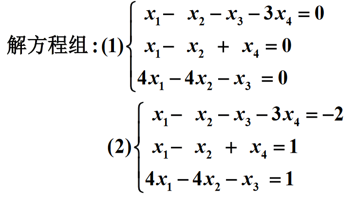
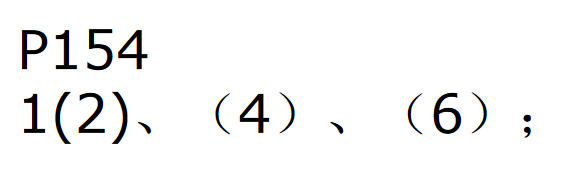

# 1.

## (1)

$$
\begin{aligned}
&
\begin{bmatrix}
1 &-1 &-1 &-3 \\
1 &-1 &0 &1 \\
4 &-4 &-1 &0 \\
\end{bmatrix}=
\begin{bmatrix}
1 &-1 &-1 &-3 \\
0 &0 &1 &4 \\
0 &0 &3 &12 \\
\end{bmatrix}=
\begin{bmatrix}
1 &-1 &-1 &-3 \\
0 &0 &1 &4 \\
0 &0 &0 &0 \\
\end{bmatrix}
\\ &=
\begin{bmatrix}
1 &-1 &0 &1 \\
0 &0 &1 &4 \\
0 &0 &0 &0 \\
\end{bmatrix}
\end{aligned}
$$

$\therefore x_1-x_2+x_4=0, x_3+4x_4=0$

## (2)

$$
\begin{aligned}
&
\begin{bmatrix}
1 &-1 &-1 &-3 &-2 \\
1 &-1 &0 &1 &1 \\
4 &-4 &-1 &0 &1 \\
\end{bmatrix}=
\begin{bmatrix}
1 &-1 &-1 &-3 &-2 \\
0 &0 &1 &4 &3 \\
0 &0 &3 &12 &9 \\
\end{bmatrix}=
\begin{bmatrix}
1 &-1 &-1 &-3 &-2 \\
0 &0 &1 &4 &3 \\
0 &0 &1 &4 &3 \\
\end{bmatrix}
\\ &=
\begin{bmatrix}
1 &-1 &-1 &-3 &-2 \\
0 &0 &1 &4 &3 \\
0 &0 &0 &0 &0 \\
\end{bmatrix}=
\begin{bmatrix}
1 &-1 &0 &1 &1 \\
0 &0 &1 &4 &3 \\
0 &0 &0 &0 &0 \\
\end{bmatrix}
\end{aligned}
$$

$\therefore x_1-x_2+x_4=1, x_3+4x_4=3$

# P154

# 1.

## (2)

$$
\begin{aligned}
&
\begin{bmatrix}
1 &2 &0 &-3 &2 &1 \\
1 &-1 &-3 &1 &-3 &2 \\
2 &-3 &4 &-5 &2 &7 \\
9 &-9 &6 &-16 &2 &25 \\
\end{bmatrix}=
\begin{bmatrix}
1 &2 &0 &-3 &2 &1 \\
0 &-3 &-3 &4 &-5 &1 \\
0 &-7 &4 &1 &-2 &5 \\
0 &-27 &6 &11 &-16 &16 \\
\end{bmatrix}
\\ &=
\begin{bmatrix}
1 &2 &0 &-3 &2 &1 \\
0 &-3 &-3 &4 &-5 &1 \\
0 &0 &33 &-25 &29 &8 \\
0 &0 &33 &-25 &29 &7 \\
\end{bmatrix}=
\begin{bmatrix}
1 &2 &0 &-3 &2 &1 \\
0 &-3 &-3 &4 &-5 &1 \\
0 &0 &33 &-25 &29 &8 \\
0 &0 &0 &0 &0 &-1 \\
\end{bmatrix}
\end{aligned}
$$

$\therefore 无解$

## (4)

$$
\begin{aligned}
&
\begin{bmatrix}
3 &4 &-5 &7 \\
2 &-3 &3 &-2 \\
4 &11 &-13 &16 \\
7 &-2 &1 &3 \\
\end{bmatrix}=
\begin{bmatrix}
3 &4 &-5 &7 \\
0 &-17 &19 &-20 \\
0 &17 &-19 &20 \\
0 &-34 &38 &-40 \\
\end{bmatrix}=
\begin{bmatrix}
3 &4 &-5 &7 \\
0 &17 &-19 &20 \\
0 &0 &0 &0 \\
0 &0 &0 &0 \\
\end{bmatrix}
\\ =&
\begin{bmatrix}
1 &\frac{4}{3} &-\frac{5}{3} &\frac{7}{3} \\
0 &1 &-\frac{19}{17} &\frac{20}{17} \\
0 &0 &0 &0 \\
0 &0 &0 &0 \\
\end{bmatrix}=
\begin{bmatrix}
1 &0 &-\frac{3}{17} &\frac{13}{17} \\
0 &1 &-\frac{19}{17} &\frac{20}{17} \\
0 &0 &0 &0 \\
0 &0 &0 &0 \\
\end{bmatrix}
\end{aligned}
$$

$\therefore x_1--\frac{3}{17}x_3+\frac{13}{17}x_4=0, x_2-\frac{19}{17}x_3+\frac{20}{17}x_4=0$

## (6)

$$
\begin{aligned}
&
\begin{bmatrix}
1 &2 &3 &-1 &1 \\
3 &2 &1 &-1 &1 \\
2 &3 &1 &1 &1 \\
2 &2 &2 &-1 &1 \\
5 &5 &2 &0 &2 \\
\end{bmatrix}=
\begin{bmatrix}
1 &2 &3 &-1 &1 \\
0 &-4 &-8 &2 &-2 \\
0 &-1 &-5 &3 &-1 \\
0 &-2 &-4 &1 &-1 \\
0 &-5 &-13 &5 &-3 \\
\end{bmatrix}=
\begin{bmatrix}
1 &2 &3 &-1 &1 \\
0 &1 &5 &-3 &1 \\
0 &2 &4 &-1 &1 \\
0 &5 &13 &-5 &3 \\
0 &0 &0 &0 &0 \\
\end{bmatrix}
\\ =&
\begin{bmatrix}
1 &2 &3 &-1 &1 \\
0 &1 &5 &-3 &1 \\
0 &0 &-6 &5 &-1 \\
0 &0 &-12 &10 &-2 \\
0 &0 &0 &0 &0 \\
\end{bmatrix}=
\begin{bmatrix}
1 &2 &3 &-1 &1 \\
0 &1 &5 &-3 &1 \\
0 &0 &1 &-\frac{5}{6} &\frac{1}{6} \\
0 &0 &0 &0 &0 \\
0 &0 &0 &0 &0 \\
\end{bmatrix}=
\begin{bmatrix}
1 &2 &0 &\frac{3}{2} &\frac{1}{2} \\
0 &1 &0 &\frac{7}{6} &\frac{1}{6} \\
0 &0 &1 &-\frac{5}{6} &\frac{1}{6} \\
0 &0 &0 &0 &0 \\
0 &0 &0 &0 &0 \\
\end{bmatrix}
\\ =&
\begin{bmatrix}
1 &0 &0 &-\frac{5}{6} &\frac{1}{6} \\
0 &1 &0 &\frac{7}{6} &\frac{1}{6} \\
0 &0 &1 &-\frac{5}{6} &\frac{1}{6} \\
0 &0 &0 &0 &0 \\
0 &0 &0 &0 &0 \\
\end{bmatrix}
\end{aligned}
$$

$\displaystyle\therefore x_1=\frac{1}{6}+\frac{5}{6}x_4, x_2=\frac{1}{6}-\frac{7}{6}x_4, x_3=\frac{1}{6}+\frac{5}{6}x_4$

# 2.(2)

$构建线性方程组:$

$$
\begin{aligned}
&
\begin{bmatrix}
1 &2 &1 &0 &0 \\
1 &1 &1 &1 &0 \\
0 &3 &0 &-1 &0 \\
1 &1 &0 &-1 &1 \\
\end{bmatrix}=
\begin{bmatrix}
1 &2 &1 &0 &0 \\
0 &-1 &0 &1 &0 \\
0 &3 &0 &-1 &0 \\
0 &-1 &-1 &-1 &1 \\
\end{bmatrix}=
\begin{bmatrix}
1 &2 &1 &0 &0 \\
0 &1 &0 &-1 &0 \\
0 &0 &1 &2 &-1 \\
0 &0 &0 &1 &0 \\
\end{bmatrix}
\\ =&
\begin{bmatrix}
1 &2 &1 &0 &0 \\
0 &1 &0 &0 &0 \\
0 &0 &1 &0 &-1 \\
0 &0 &0 &1 &0 \\
\end{bmatrix}=
\begin{bmatrix}
1 &0 &0 &0 &1 \\
0 &1 &0 &0 &0 \\
0 &0 &1 &0 &-1 \\
0 &0 &0 &1 &0 \\
\end{bmatrix}
\end{aligned}
$$

$\therefore k_1=1,k_3=-1,k_2=k_4=0$

$\therefore \vec\beta=\vec\alpha_1-\vec\alpha_3$

# 3.

$设有不全为零的k_i使得:$

$k_1\vec\alpha_1+k_2\vec\alpha_2+\cdots+k_r\vec\alpha_r+k_0\vec\beta=0$

$当k_0=0时, 则有k_0\vec\beta=0$

$\therefore 有不全为零的k_i, i\geq 1使得k_1\vec\alpha_1+k_2\vec\alpha_2+\cdots+k_r\vec\alpha_r=0$

$\therefore 与\vec\alpha_1,\vec\alpha_2,\cdots,\vec\alpha_r线性无关矛盾, k_0=0不成立$

$当k_0\neq 0时,$

$\therefore\displaystyle \vec\beta=-\frac{k_1}{k_0}\vec\alpha_1-\frac{k_2}{k_0}\vec\alpha_2-\cdots-\frac{k_r}{k_0}\vec\alpha_r$

$\therefore 向量\vec\beta可由\vec\alpha_1,\vec\alpha_2,\cdots,\vec\alpha_r线性表出$

# 4.

$\because |a_{ij}|\neq 0$

$\therefore |a_{ij}|对应的方程组k_1\vec\alpha_1+k_2\vec\alpha_2+\cdots+k_r\vec\alpha_n=0, 即$

$$
\begin{cases}
a_{11}k_1+a_{12}k_2+\cdots+a_{1n}k_n=0 \\
a_{21}k_1+a_{22}k_2+\cdots+a_{2n}k_n=0 \\
\cdots \\
a_{n1}k_1+a_{n2}k_2+\cdots+a_{nn}k_n=0 \\
\end{cases}
$$

$\quad 的齐次线性方程组的根仅有唯一的零解$

$\therefore 使得该式成立的k_i一定全都为0$

$\therefore \vec\alpha_1,\vec\alpha_2,\cdots,\vec\alpha_n线性无关$

# 6.

$设k_1(\vec\alpha_1+\vec\alpha_2)+k_2(\vec\alpha_2+\vec\alpha_3)+k_3(\vec\alpha_3+\vec\alpha_1)=0$

$\therefore (k_1+k_3)\vec\alpha_1+(k_1+k_2)\vec\alpha_2+(k_2+k_3)\vec\alpha_3=0$

$\because \vec\alpha_1,\vec\alpha_2,\vec\alpha_3线性无关$

$\therefore k_1+k_3=0, k_2+k_3=0, k_1+k_2=0$

$\therefore k_1=k_2=k_3=0$

$\therefore \vec\alpha_1+\vec\alpha_2, \vec\alpha_2+\vec\alpha_3, \vec\alpha_3+\vec\alpha_1也线性无关$

# 9.

$设一个向量组有一个线性无关组\vec\alpha_1, \vec\alpha_2, \cdots, \vec\alpha_r,$
$我们取向量组的任意一个极大线性无关组\vec\beta_1, \vec\beta_2, \cdots, \vec\beta_n$

$易知\vec\alpha_i可用\vec\beta_j表示, 即$

$$
\begin{cases}
k_{11}\vec\beta_1+k_{12}\vec\beta_2+\cdots+k_{1n}\vec\beta_n=\vec\alpha_1 \\
k_{21}\vec\beta_1+k_{22}\vec\beta_2+\cdots+k_{2n}\vec\beta_n=\vec\alpha_2 \\
\cdots \\
k_{n1}\vec\beta_1+k_{n2}\vec\beta_2+\cdots+k_{rn}\vec\beta_n=\vec\alpha_r \\
\end{cases}
$$

$若r=n, \vec\beta_j可由\vec\alpha_i唯一地表示$

$此时\vec\alpha_1, \vec\alpha_2, \cdots, \vec\alpha_r已是极大线性无关组$

$若r<n, 则可知$

$\vec\beta_j=\displaystyle\sum_{i=1}^rd_{ji}\vec\alpha_i+\sum_{i=r+1}^nd_{ji}\vec\beta_i$

$\therefore 只需给\vec\alpha_1, \vec\alpha_2, \cdots, \vec\alpha_r加入\vec\beta_{r+1}, \vec\beta_{r+2}, \cdots, \vec\beta_n即可成为极大线性无关组$

# 11.(1)

# 13.

$由题目易知$

$$
\begin{cases}
k_{11}\vec\alpha_1+k_{12}\vec\alpha_2+\cdots+k_{1n}\vec\alpha_n=\vec\varepsilon_1 \\
k_{21}\vec\alpha_1+k_{22}\vec\alpha_2+\cdots+k_{2n}\vec\alpha_n=\vec\varepsilon_2 \\
\cdots \\
k_{n1}\vec\alpha_1+k_{n2}\vec\alpha_2+\cdots+k_{nn}\vec\alpha_n=\vec\varepsilon_n \\
\end{cases}
$$

$可知方程组解唯一, 即\vec\alpha_j可由\vec\varepsilon_i唯一线性表示$

$\therefore\vec\alpha_j=\displaystyle\sum_{i=1}^nd_{ji}\vec\varepsilon_i$

$设k_1\vec\alpha_1+k_2\vec\alpha_2+\cdots+k_n\vec\alpha_r=0$

$\therefore\displaystyle k_1\sum_{i=1}^nd_{1i}\vec\varepsilon_i+k_2\sum_{i=1}^nd_{2i}\vec\varepsilon_i+\cdots+k_n\sum_{i=1}^nd_{ni}\vec\varepsilon_i=0$

$\therefore\displaystyle \vec\varepsilon_1\sum_{i=1}^nk_id_{i1}+\vec\varepsilon_2\sum_{i=1}^nk_id_{i2}+\cdots+\vec\varepsilon_n\sum_{i=1}^nk_id_{in}=0$

$\because\vec\varepsilon_1,\vec\varepsilon_2,\cdots,\vec\varepsilon_n线性无关$

$\therefore 可知存在线性方程组$

$$
\begin{cases}
d_{11}k_{1}+d_{21}k_{2}+\cdots+d_{n1}k_{n}=0 \\
d_{12}k_{1}+d_{22}k_{2}+\cdots+d_{n2}k_{n}=0 \\
\cdots \\
d_{1n}k_{1}+d_{2n}k_{2}+\cdots+d_{nn}k_{n}=0 \\
\end{cases}
$$

$\because |d_{ij}|\neq 0$

$\therefore k_1=k_2=\cdots=k_n=0$

$\therefore \vec\alpha_1,\vec\alpha_2,\cdots,\vec\alpha_n线性无关$

# 16.

