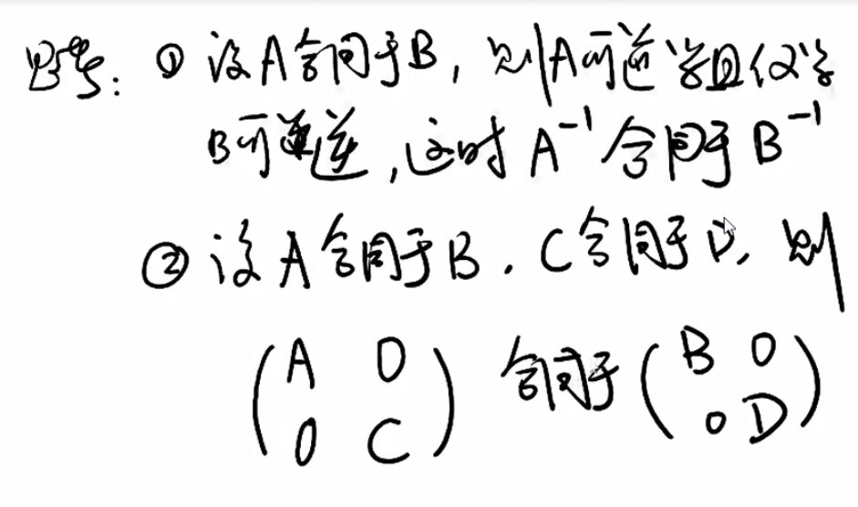

<!-- 

 -->

# 思考

## 1.

证明: 设 $A$ 合同于 $B$, 则 $A$ 可逆当且仅当 $B$ 可逆, 此时 $A^{-1}$ 合同于 $B^{-1}$.

$\because$ $A$ 合同于 $B$

$\therefore B=C' AC$, $C$ 可逆, 即 $|C|\neq 0$

$\therefore |B|=|C' AC|=|C|^2|A|$

$\therefore |B|=0$ 当且仅当 $|A|=0$

$\therefore$ $A$ 可逆当且仅当 $B$ 可逆

$\because B^{-1}=(C' AC)^{-1}=C^{-1} A^{-1} (C')^{-1}=C^{-1} A^{-1} (C^{-1})'$

$\therefore$ $A^{-1}$ 合同于 $B^{-1}$

## 2.

证明: 设 $A$ 合同于 $B$, $C$ 合同于 $D$, 则 $\begin{pmatrix}A&0\\0&C\end{pmatrix}$ 合同于 $\begin{pmatrix}B&0\\0&D\end{pmatrix}$.

$\because B=E' AE, D=F' CF$

$\therefore \begin{pmatrix}B&0\\0&D\end{pmatrix}=\begin{pmatrix}E' AE&0\\0&F' CF\end{pmatrix}=\begin{pmatrix}E&0\\0&F\end{pmatrix}'\begin{pmatrix}A&0\\0&C\end{pmatrix}\begin{pmatrix}E&0\\0&F\end{pmatrix}$

# 练习

## 1.

$
\begin{pmatrix}0&-2&1\\-2&0&1\\1&1&0\end{pmatrix}
$

## 2.

$
\begin{pmatrix}1&\frac{5}{2}&6\\\frac{5}{2}&4&7\\6&7&5\end{pmatrix}
$

## 3.

$
\begin{pmatrix}1&\frac{1}{2}&\cdots &\frac{1}{2}\\\frac{1}{2}&1&\cdots &\frac{1}{2}\\\vdots &\vdots & &\vdots \\\frac{1}{2}&\frac{1}{2}&\cdots &1\end{pmatrix}
$

## 4.

$
\begin{aligned}
\because\sum_{i=1}^n(x_i-\overline{x})^2
&=\sum_{i=1}^n(x_i^2-2x_i\overline{x}+\overline{x}^2) \\
&=\sum_{i=1}^nx_i^2-2\overline{x}\sum_{i=1}^nx_i+n\overline{x}^2 \\
&=\sum_{i=1}^nx_i^2-\frac{1}{n}(\sum_{i=1}^nx_i)^2 \\
&=\sum_{i=1}^nx_i^2-\frac{1}{n}(\sum_{i=1}^nx_i^2+2\sum_{i<j}x_ix_j) \\
&=\frac{n-1}{n}\sum_{i=1}^nx_i^2-\frac{2}{n}\sum_{i<j}x_ix_j \\
\end{aligned}
$

$
\begin{pmatrix}\frac{n-1}{n}&-\frac{1}{n}&\cdots &-\frac{1}{n}\\-\frac{1}{n}&\frac{n-1}{n}&\cdots &-\frac{1}{n}\\\vdots &\vdots & &\vdots \\-\frac{1}{n}&-\frac{1}{n}&\cdots &\frac{n-1}{n}\end{pmatrix}
$
