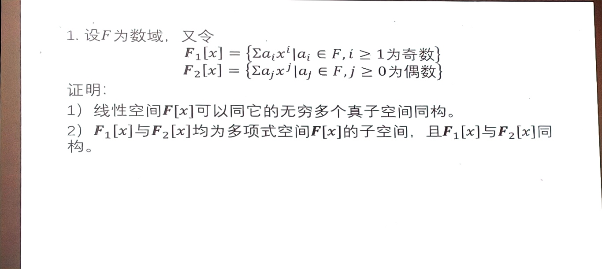

# 习题课

<!-- ## 10. -->

<!-- 设向量 $\xi$ 坐标为 $(a_1,a_2,a_3,a_4)$ -->

<!-- $$
\begin{cases}
2a_1+5a_3+6a_4=a_1 \\
3a_2+a_3=a_2 \\
5a_1+3a_2+2a_3+a_4=a_1 \\
6a_1+6a_2+a_3+3a_4=a_1 \\
\end{cases}
$$ -->

<!-- $$
\begin{aligned}
&\begin{pmatrix}1&0&5&6\\1&2&3&6\\-1&0&0&3\\1&0&1&2\end{pmatrix}\xrightarrow[r_4-r_1]{r_2-r_1, r_3+r_1}\begin{pmatrix}1 &0 &5 &6 \\0 &2 &-2 &0 \\0 &0 &5 &9 \\0 &0 &-4 &-4\end{pmatrix}\xrightarrow[-\frac{1}{4}r_4]{\frac{1}{2}r_2}\begin{pmatrix}1 &0 &5 &6 \\0 &1 &-1 &0 \\0 &0 &5 &9 \\0 &0 &1 &1\end{pmatrix} \\
\xrightarrow[r_3\leftrightarrow r_4]{r_3-5r_4,\frac{1}{4}r_3}
&\begin{pmatrix}1 &0 &5 &6 \\0 &1 &-1 &0 \\0 &0 &1 &1 \\0 &0 &0 &1\end{pmatrix} \\
\end{aligned}
$$ -->

## 14.

求与 $A=\begin{pmatrix}1&0&0\\0&1&0\\3&1&2\end{pmatrix}$ 可交换的矩阵组成的子空间的基和维度.

令 $T=A-E$, 则有 $(A-E)B=B(A-E)$

解方程.

$C(A)$ 为 5 维.

<!-- 设 $B=(b_{ij})_{3\times 3}$

$\therefore AB=\begin{pmatrix}1&0&0\\0&1&0\\3&1&2\end{pmatrix}\begin{pmatrix}b_{11}&b_{12}&b_{13}\\b_{21}&b_{22}&b_{23}\\b_{31}&b_{32}&b_{33}\end{pmatrix}=\begin{pmatrix}b_{11}&b_{12}&b_{13}\\b_{21}&b_{22}&b_{23}\\3b_{11}+b_{21}+2b_{31}&3b_{12}+b_{22}+2b_{32}&3b_{13}+b_{23}+2b_{33}\end{pmatrix}$

$\quad BA=\begin{pmatrix}b_{11}&b_{12}&b_{13}\\b_{21}&b_{22}&b_{23}\\b_{31}&b_{32}&b_{33}\end{pmatrix}\begin{pmatrix}1&0&0\\0&1&0\\3&1&2\end{pmatrix}=\begin{pmatrix}b_{11}+3b_{13}&b_{12}+b_{13}&2b_{13}\\b_{21}+3b_{23}&b_{22}+b_{23}&2b_{23}\\b_{31}+3b_{33}&b_{32}+b_{33}&2b_{33}\end{pmatrix}$

令 $AB=BA$ 得

$$
\begin{cases}
b_{13}=0 \\
b_{23}=0 \\
3b_{11}+b_{21}+2b_{31}=b_{31}+3b_{33} \\
\end{cases}
$$ -->

## 1.

## 2.

